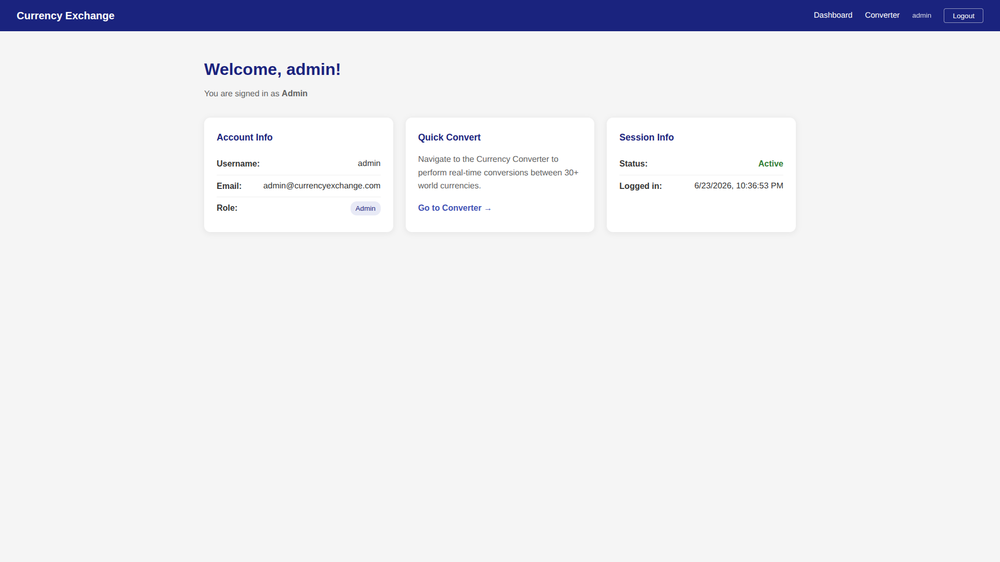

# Currency Exchange Platform

A full-stack web application built with ASP.NET Core 10 Web API and Angular 18 featuring JWT authentication and real-time currency conversion.

## Features

- **JWT Authentication** — Login with predefined credentials (no database required)
- **Protected Routes** — Route guards redirect unauthenticated users to login
- **Currency Converter** — Real-time conversion using ExchangeRate API
- **Responsive UI** — Clean, modern interface with Angular 18

## Sample Credentials

| Username | Password | Role  |
|----------|----------|-------|
| admin    | admin123 | Admin |
| user     | user123  | User  |

## Tech Stack

- **Backend:** ASP.NET Core 10 Web API, JWT Bearer Authentication, Memory Caching
- **Frontend:** Angular 18, Reactive Forms, Route Guards, HTTP Interceptors
- **Currency API:** [ExchangeRate-API](https://www.exchangerate-api.com/)

## Project Structure

```
├── Backend/                    # ASP.NET Core Web API
│   ├── Controllers/           # Auth & Currency controllers
│   ├── Models/                # DTOs and configuration models
│   ├── Services/              # AuthService, CurrencyService
│   ├── Program.cs             # App entry point
│   └── appsettings.json       # JWT config & sample credentials
├── Frontend/                   # Angular 18 application
│   └── src/app/
│       ├── components/        # Public, Login, Dashboard, CurrencyConverter
│       ├── services/          # AuthService, CurrencyService
│       ├── guards/            # authGuard, publicGuard
│       ├── interceptors/      # JWT token interceptor
│       └── models/            # TypeScript interfaces
└── README.md
```

## Setup Instructions

### Prerequisites
- .NET 10 SDK
- Node.js 18+ and npm

### Backend

```bash
cd Backend
dotnet restore
dotnet run
```

The API will start on `http://localhost:5059`.

### Frontend

```bash
cd Frontend
npm install
ng serve
```

The Angular app will start on `http://localhost:4200`.

### Running Both

Open two terminals and run the backend and frontend simultaneously. The Angular app proxies API calls to `http://localhost:5059`.

## API Endpoints

| Method | Endpoint              | Description           | Auth Required |
|--------|-----------------------|-----------------------|---------------|
| POST   | /api/auth/login       | Login and get JWT     | No            |
| GET    | /api/auth/me          | Get current user      | Yes           |
| GET    | /api/auth/validate    | Validate token        | No            |
| GET    | /api/currency/currencies | Get supported currencies | Yes        |
| POST   | /api/currency/convert | Convert currency      | Yes           |

## Application Screenshots

### Public Page
> Landing page accessible to anyone, with features overview and sample credentials.
>
> 

### Login Page
> Login form with reactive form validation and error handling.
>
> 

### Dashboard
> Secured page showing user info and session details. Only accessible to authenticated users.
>
> 

### Currency Converter
> Select source/destination currencies, enter an amount, and view real-time conversion results.
>
> 

## Design Decisions

- **JWT over Cookie**: JWT is stateless and works well with SPA architecture
- **Memory Caching**: Exchange rates cached for 30 minutes to reduce API calls
- **Configuration-based credentials**: Credentials stored in `appsettings.json` as required (no database)
- **Functional route guards**: Uses Angular 18 functional guards with `CanActivateFn`
- **Functional interceptors**: Uses Angular 18 functional interceptor with `HttpInterceptorFn`
